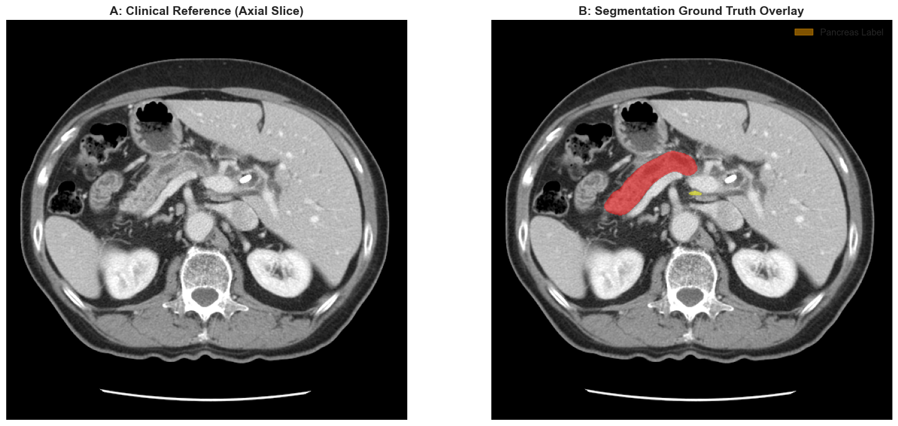
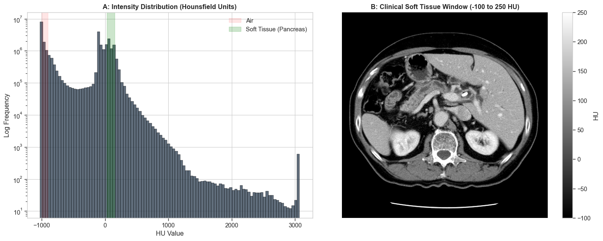
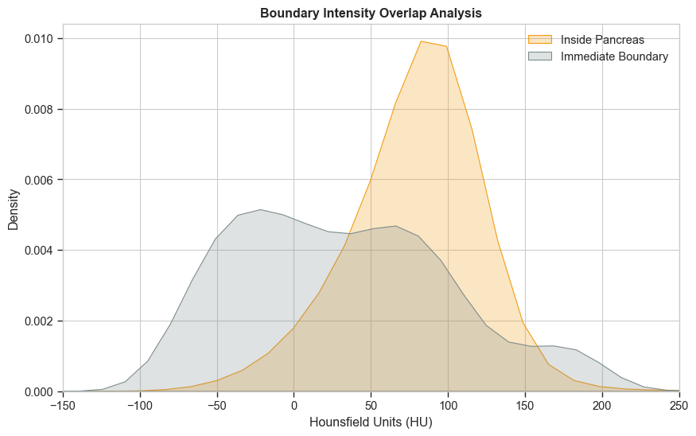
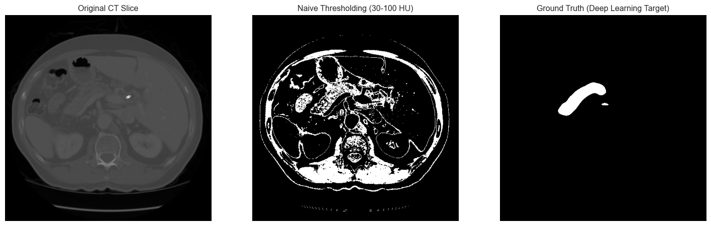
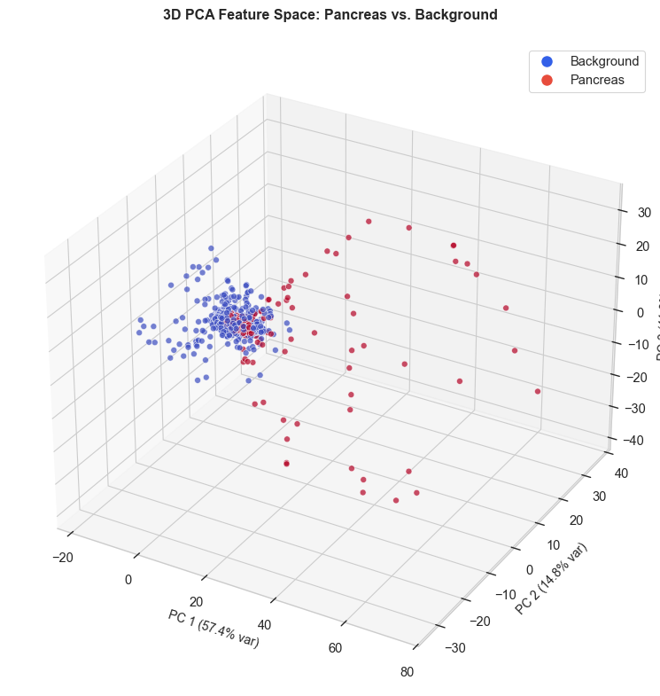
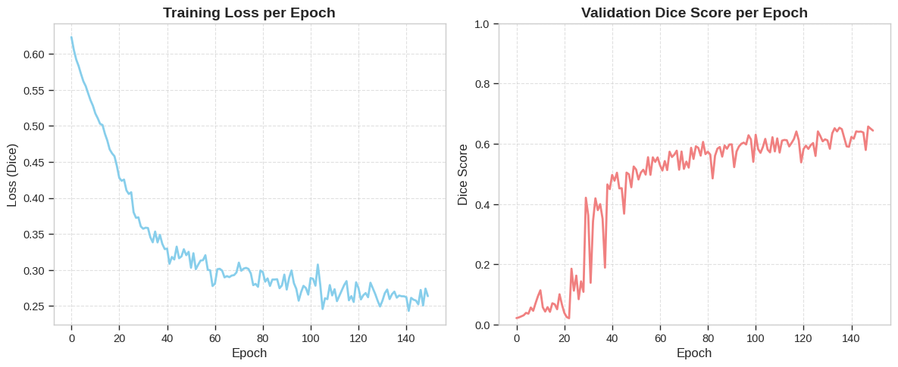
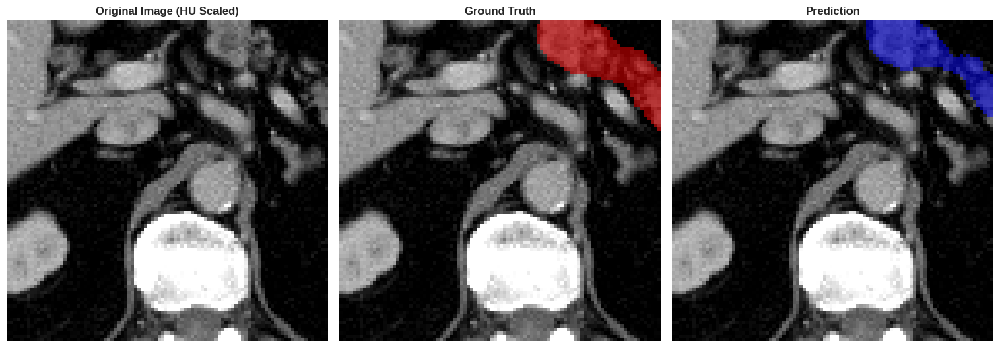
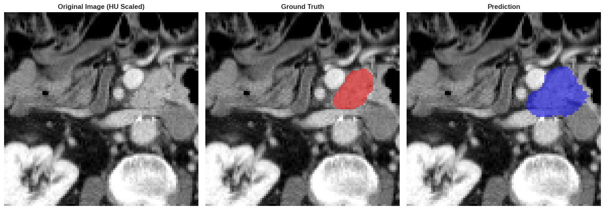
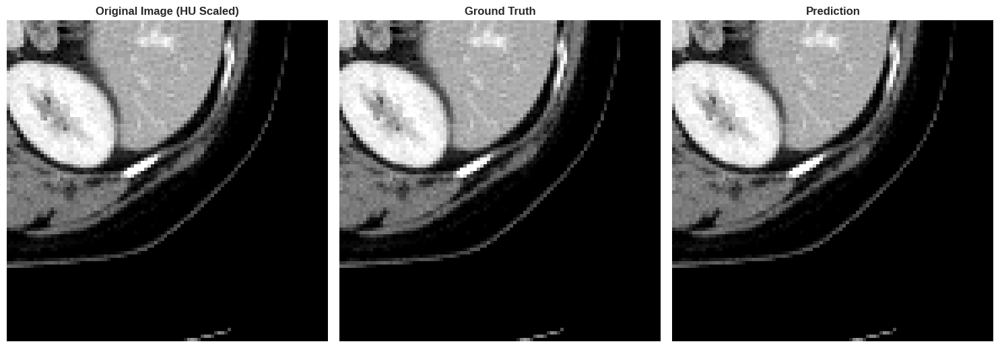

# CT-Segmentation

[](https://www.python.org/)
[](https://opensource.org/licenses/MIT)

This repository transitions from the physical foundations of CT reconstruction to clinical image analysis. 

## About me
I am a young AI student and would like to apply the knowledge I have learned in order to continue learning. This project is part of my “CT learning journey.” Click here for the CT basics ([link](https://github.com/yannikFruehwirth/ct-reconstruction-foundations)).
If you notice any mistakes or want to make suggestions, please feel free to reach out to me (Yannik.fruehwirth@web.de).

## Project Overview
While traditional reconstruction focuses on image quality, this project focuses on automated information extraction. Usage of the Medical Segmentation Decathlon (MSD) dataset ([link to paper](https://arxiv.org/pdf/1902.09063)).

## Data Analysis
| Visualization | Description | Plot |
| :-- | :-- | :--- |
| **Sample** | **Left** sample w/o pancreas segmentation mask <br>**Right:** sample with pancreas segmentation mask  | ** |
| **Windowing** | **Left** Intensity distribution incl. pancreas window <br>**Right:** Intensity Filtered slice| ** |
| **Boundary Intensity Overlap Analysis** | **brown** pancreas intensity <br>**grey:** Intensity of adjacent objects/ intensity of boundaries | ** |

## Segmentation "Journey"
| Visualization | Description | Plot | Interpretation |
| :-- | :-- | :--- | :--- |
| **[Baseline](notebooks/02a_seg_baseline.ipynb)** | **Left** Original CT slice <br>**Mid:** Naive Thresholding <br>**Right** Ground truth  | ** | too naive -> PCA |
| **[PCA](notebooks/02b_seg_pca.ipynb)** | **PCA** PC1-PC3 <br> | ** | high explainability in PC1-PC3 BUT significant overlap -> advanced methods|
| **[U-Net](notebooks/02c_seg_unet.ipynb)** | **First** Training history <br>**Other:** Prediction examples  | ** ** ** ** | ~200 training samples,A100 GPU <br><br> Top validation dice score: ~0.66 <br><br> default UNet (no hyperparams tuning), patch based augmentration <br> <br> significant segmentation, model understands spatial complexity |

## Repository Structure
* `src/`: Code for data pipelines, model architectures, and training.
* `notebooks/`: Data Analysis and qualitative model evaluation.
* `data/`: Storage for data.
* `models/`: Best Unet model.
* `results/`: Samples of unet prediction.

## Installation & Usage

### Prerequisites
This project uses **uv** for dependency management. Install it via:
```bash
curl -LsSf [https://astral.sh/uv/install.sh](https://astral.sh/uv/install.sh) | sh
```

## Setup
```bash
git clone https://github.com/yannikFruehwirth/ct-segmentation-monai
cd ct-segmentation-monai
uv sync
```

## Data Download
```bash
uv run src/data/download_data.py
```

## Run analysis
### Data Exploration
Run [data exploration](notebooks/01_data_exploration.ipynb).

### Baseline model/ naive thresholding
Run [baseline model](notebooks/02a_seg_baseline.ipynb).

### PCA
Run [PCA](notebooks/02b_seg_pca.ipynb).

### U-Net
Run [U-Net](notebooks/02c_seg_unet.ipynb) (preferably GPU).
